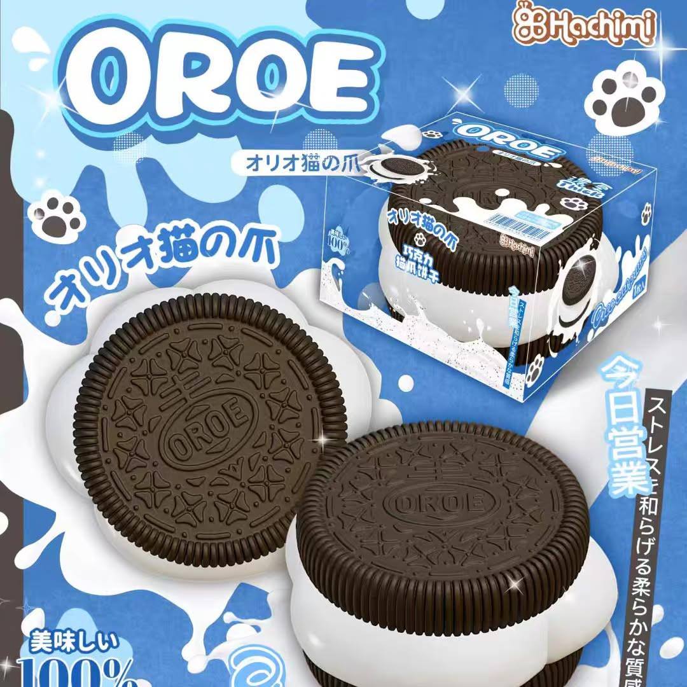
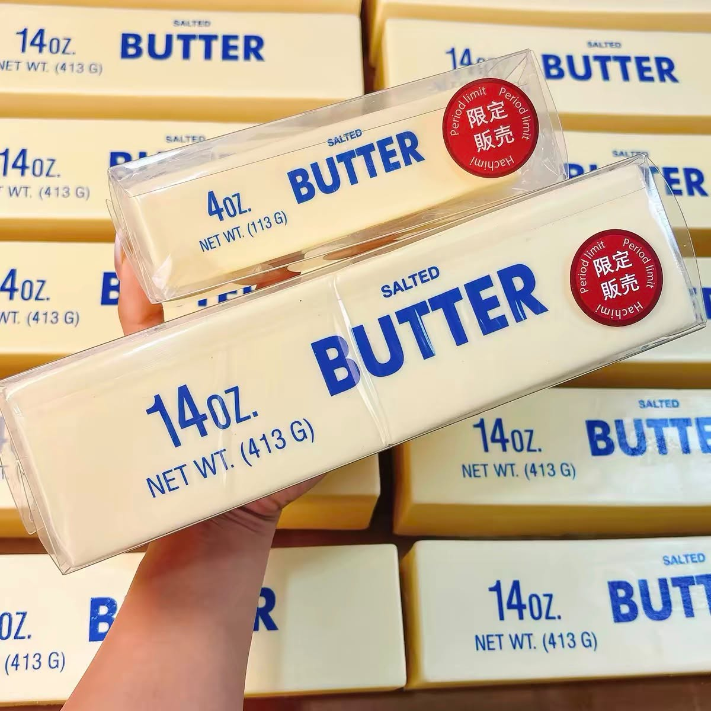
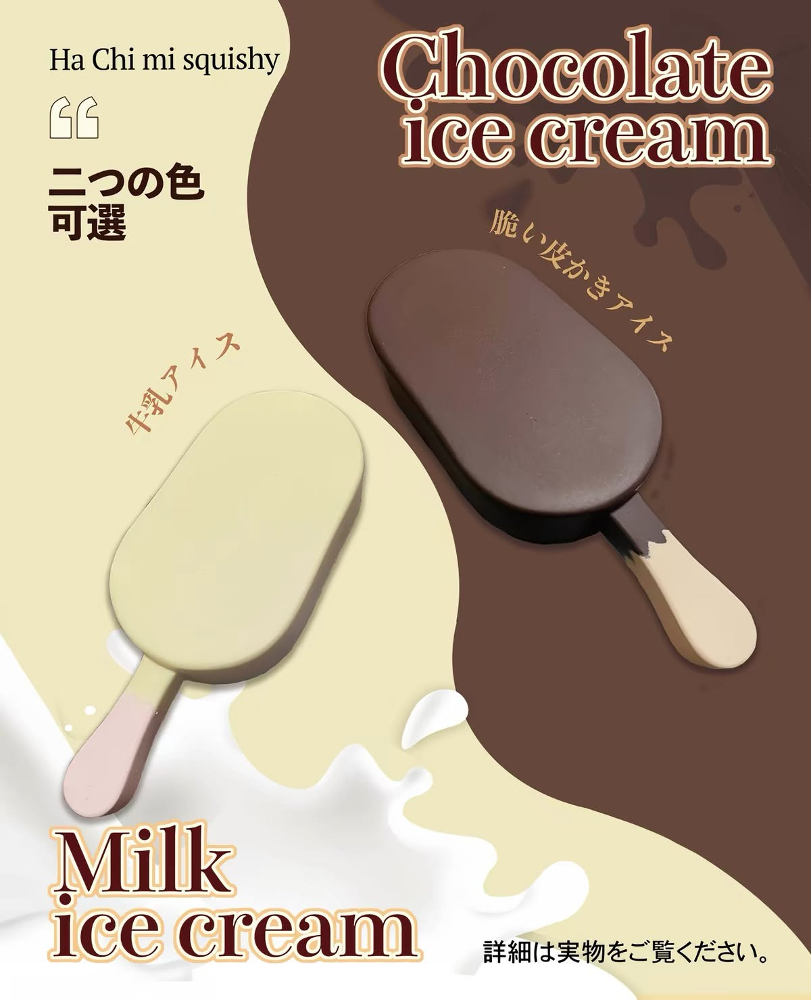
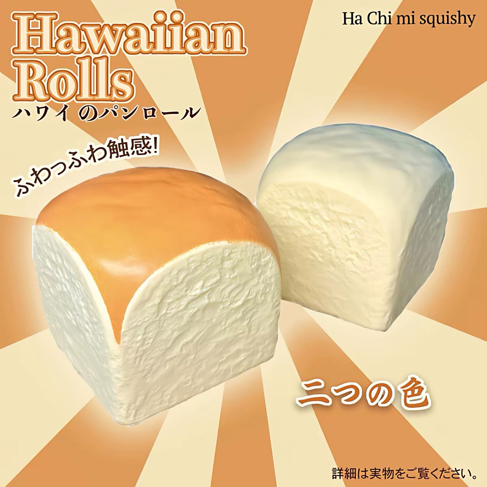

<!DOCTYPE html>
<html lang="th">
<head>
  <meta charset="UTF-8">
  <meta name="viewport" content="width=device-width, initial-scale=1.0">
  <title>DEBLUTE - Flower Design</title>
  <link href="https://fonts.googleapis.com/css2?family=Cinzel:wght@500;600&family=Prompt:wght@300;400;500;600&display=swap" rel="stylesheet">
  <style>
    * {
      box-sizing: border-box;
      margin: 0;
      padding: 0;
      font-family: 'Prompt', sans-serif;
    }
    * {
      box-sizing: border-box;
      margin: 0;
      padding: 0;
      font-family: 'Prompt', sans-serif;
    }

    body {
      background-color: #fdfbf7;
      color: #4a4238;
      line-height: 1.6;
    }

    /* Top Bar */
    .top-bar {
      background-color: #e6dac8;
      text-align: center;
      padding: 0.5rem;
      font-size: 0.85rem;
      color: #5c4e3e;
      letter-spacing: 0.5px;
    }

    /* Header */
    header {
      background-color: #f7f1e5;
      text-align: center;
      padding: 2.5rem 1rem;
      border-bottom: 1px solid #ebd3;
      position: relative;
    }

    .brand-logo {
      font-family: 'Cinzel', serif;
      font-size: 2.8rem;
      font-weight: 600;
      letter-spacing: 6px;
      color: #3b3123;
      margin-bottom: 0.2rem;
    }

    .brand-sub {
      font-size: 0.85rem;
      letter-spacing: 3px;
      color: #8c765c;
      text-transform: uppercase;
    }

    /* Cart Button Floating / Header Header */
    .cart-icon-btn {
      position: fixed;
      bottom: 2rem;
      right: 2rem;
      background-color: #3b3123;
      color: #ffffff;
      border: none;
      border-radius: 50px;
      padding: 0.8rem 1.5rem;
      font-size: 1rem;
      cursor: pointer;
      box-shadow: 0 4px 12px rgba(0,0,0,0.15);
      z-index: 1000;
      display: flex;
      align-items: center;
      gap: 0.5rem;
    }

    .cart-badge {
      background-color: #b05843;
      color: white;
      border-radius: 50%;
      padding: 0.2rem 0.6rem;
      font-size: 0.8rem;
      font-weight: bold;
    }

    /* Navigation */
    nav {
      background-color: #ffffff;
      border-bottom: 1px solid #ece4d8;
      position: sticky;
      top: 0;
      z-index: 100;
      box-shadow: 0 2px 5px rgba(0,0,0,0.02);
    }

    nav ul {
      display: flex;
      justify-content: center;
      list-style: none;
      flex-wrap: wrap;
    }

    nav a {
      display: block;
      padding: 0.9rem 1.4rem;
      text-decoration: none;
      color: #52473b;
      font-size: 0.9rem;
      font-weight: 400;
      transition: all 0.3s ease;
    }

    nav a:hover, nav a.active {
      color: #a37d55;
      background-color: #fdfbf7;
    }

    /* Container & Product Grid */
    .container {
      max-width: 1200px;
      margin: 2.5rem auto;
      padding: 0 1.5rem;
    }

    .category-title {
      font-size: 1.6rem;
      font-weight: 500;
      text-align: center;
      color: #3b3123;
      margin-bottom: 0.3rem;
    }

    .category-subtitle {
      text-align: center;
      color: #8c765c;
      font-size: 0.9rem;
      margin-bottom: 2rem;
    }

    .product-grid {
      display: grid;
      grid-template-columns: repeat(auto-fill, minmax(260px, 1fr));
      gap: 2rem;
    }

    .product-card {
      background: #ffffff;
      border: 1px solid #f0e6d8;
      border-radius: 6px;
      overflow: hidden;
      text-align: center;
      padding-bottom: 1.5rem;
      transition: transform 0.3s ease, box-shadow 0.3s ease;
    }

    .product-card:hover {
      transform: translateY(-5px);
      box-shadow: 0 10px 20px rgba(0,0,0,0.05);
    }

    .product-image-wrap {
      width: 100%;
      height: 280px;
      background-color: #f5efe6;
      overflow: hidden;
    }

    .product-image-wrap img {
      width: 100%;
      height: 100%;
      object-fit: cover;
      transition: transform 0.5s ease;
    }

    .product-card:hover .product-image-wrap img {
      transform: scale(1.05);
    }

    .product-card h3 {
      font-size: 1.1rem;
      font-weight: 500;
      color: #3b3123;
      margin: 1.2rem 0 0.4rem;
    }

    .price-container {
      margin-bottom: 1rem;
    }

    .original-price {
      text-decoration: line-through;
      color: #a89a8b;
      font-size: 0.88rem;
      margin-right: 0.4rem;
    }

    .sale-price {
      color: #b05843;
      font-weight: 600;
      font-size: 1.15rem;
    }

    .btn-cart {
      background-color: #8c7355;
      color: #ffffff;
      border: none;
      padding: 0.65rem 1.4rem;
      border-radius: 4px;
      cursor: pointer;
      font-size: 0.88rem;
      letter-spacing: 0.5px;
      transition: background-color 0.3s ease;
    }

    .btn-cart:hover {
      background-color: #6b563d;
    }

    /* Modal ตะกร้าสินค้า */
    .cart-modal {
      display: none;
      position: fixed;
      top: 0;
      left: 0;
      width: 100%;
      height: 100%;
      background-color: rgba(0, 0, 0, 0.4);
      z-index: 2000;
      justify-content: center;
      align-items: center;
    }

    .cart-modal-content {
      background: white;
      width: 90%;
      max-width: 500px;
      border-radius: 8px;
      padding: 1.5rem;
      box-shadow: 0 10px 25px rgba(0,0,0,0.1);
      max-height: 80vh;
      display: flex;
      flex-direction: column;
    }

    .cart-header {
      display: flex;
      justify-content: space-between;
      align-items: center;
      border-bottom: 1px solid #eee;
      padding-bottom: 0.8rem;
    }

    .cart-header h3 {
      color: #3b3123;
    }

    .close-btn {
      background: none;
      border: none;
      font-size: 1.5rem;
      cursor: pointer;
      color: #888;
    }

    .cart-items {
      flex: 1;
      overflow-y: auto;
      margin: 1rem 0;
    }

    .cart-item {
      display: flex;
      justify-content: space-between;
      align-items: center;
      margin-bottom: 0.8rem;
      padding-bottom: 0.8rem;
      border-bottom: 1px solid #f9f9f9;
    }

    .qty-btn {
      background: #e6dac8;
      border: none;
      width: 24px;
      height: 24px;
      border-radius: 4px;
      cursor: pointer;
      font-weight: bold;
    }

    .cart-footer {
      border-top: 1px solid #eee;
      padding-top: 1rem;
    }

    .total-price {
      display: flex;
      justify-content: space-between;
      font-size: 1.1rem;
      font-weight: 600;
      margin-bottom: 1rem;
    }

    .btn-checkout {
      width: 100%;
      background-color: #00b900; /* สีเขียว Line */
      color: white;
      border: none;
      padding: 0.8rem;
      border-radius: 4px;
      font-size: 1rem;
      cursor: pointer;
      font-weight: 500;
    }

    /* Footer */
    footer {
      background-color: #f2e9dc;
      color: #5c4e3e;
      padding: 3rem 1.5rem 1.5rem;
      margin-top: 4rem;
      border-top: 1px solid #e0d4c3;
    }

    .footer-content {
      max-width: 1200px;
      margin: 0 auto;
      display: grid;
      grid-template-columns: repeat(auto-fit, minmax(220px, 1fr));
      gap: 2rem;
      margin-bottom: 2rem;
      text-align: left;
    }

    .footer-col h4 {
      font-family: 'Cinzel', serif;
      font-size: 1.1rem;
      margin-bottom: 0.8rem;
      color: #3b3123;
    }

    .footer-col p, .footer-col a {
      font-size: 0.88rem;
      color: #6e5e4d;
      text-decoration: none;
      margin-bottom: 0.4rem;
      display: block;
    }

    .footer-bottom {
      text-align: center;
      border-top: 1px solid #e0d4c3;
      padding-top: 1.5rem;
      font-size: 0.8rem;
      color: #8c7b69;
    }
  </style>
</head>
<body>

  <div class="top-bar">
    บริการจัดส่ง บริเวณ ซอยKave Town Plum condo และ ม.กรุงเทพ
  </div>

  <header>
    <div class="brand-logo">DEBLUTE</div>
    <div class="brand-sub">FLOWER DESIGN & HOUSE</div>
  </header>

  <!-- ปุ่มตะกร้าสินค้าแบบลอย -->
  <button class="cart-icon-btn" onclick="toggleCart()">
    🛒 ตะกร้า <span class="cart-badge" id="cart-count">0</span>
  </button>

  <nav>
    <ul>
      <li><a href="#">หน้าหลัก</a></li>
      <li><a href="#">ช่อดอกไม้</a></li>
      <li><a href="#" class="active">ดอกไม้กลิตเตอร์</a></li>
      <li><a href="#">ดอกไม้ผ้า</a></li>
      <li><a href="#">ดอกไม้กระดาษย่น</a></li>
      <li><a href="#">ติดต่อเรา</a></li>
       </ul>

<nav>
  ...
</nav>

<div class="container">
  <h2 class="category-title">สินค้าแนะนำ</h2>
  <p class="category-subtitle">สามารถเลือกวัตถุดิบในการประกอบช่อได้ตามความชอบ</p>
</div>
```
  
  <div class="product-grid">
  <!-- สินค้า 1: OROE -->
  <div class="product-card">
    <div class="product-image-wrap">
      
    </div>
    <h3>OROE Cookie</h3>
    <div class="price-container">
      <span class="sale-price">150 ฿</span>
    </div>
    <button class="btn-cart" onclick="addToCart('OROE Cookie', 150)">หยิบใส่ตะกร้า</button>
  </div>

  <!-- สินค้า 2: Butter -->
  <div class="product-card">
    <div class="product-image-wrap">
      
    </div>
    <h3>Butter 14oz</h3>
    <div class="price-container">
      <span class="sale-price">120 ฿</span>
    </div>
    <button class="btn-cart" onclick="addToCart('Butter 14oz', 120)">หยิบใส่ตะกร้า</button>
  </div>

  <!-- สินค้า 3: Ice Cream -->
  <div class="product-card">
    <div class="product-image-wrap">
      
    </div>
    <h3>Ice Cream</h3>
    <div class="price-container">
      <span class="sale-price">99 ฿</span>
    </div>
    <button class="btn-cart" onclick="addToCart('Ice Cream', 99)">หยิบใส่ตะกร้า</button>
  </div>

  <!-- สินค้า 4: Hawaiian Rolls -->
  <div class="product-card">
    <div class="product-image-wrap">
      
    </div>
    <h3>Hawaiian Rolls</h3>
    <div class="price-container">
      <span class="sale-price">120 ฿</span>
    </div>
    <button class="btn-cart" onclick="addToCart('Hawaiian Rolls', 120)">หยิบใส่ตะกร้า</button>
  </div>
</div>
</div>

  </div>

  <!-- หน้าต่าง Cart Modal -->
  <div class="cart-modal" id="cartModal">
    <div class="cart-modal-content">
      <div class="cart-header">
        <h3>ตะกร้าสินค้าของคุณ</h3>
        <button class="close-btn" onclick="toggleCart()">&times;</button>
      </div>
      <div class="cart-items" id="cart-items">
        <p style="text-align: center; color: #888; padding: 1rem;">ไม่มีสินค้าในตะกร้า</p>
      </div>
      <div class="cart-footer">
        <div class="total-price">
          <span>ราคารวมทั้งหมด:</span>
          <span id="total-price">0 ฿</span>
        </div>
        <button class="btn-checkout" onclick="checkoutLine()">สั่งซื้อผ่าน Line (@deblute)</button>
           </div>
   </div>
 </div>

 <footer>
   <div class="footer-content">
     <div class="footer-col">
       <h4>DEBLUTE</h4>
       <p>ร้านจัดดอกไม้สไตล์มินิมอล หรูหรา ใส่ใจทุกรายละเอียดของดอกไม้ทุกช่อ</p>
    </div>
    <div class="footer-col">
      <h4>เวลาทำการ</h4>
      <p>เปิดบริการทุกวัน: 12:00 - 00:00 น.</p>
    </div>
    <div class="footer-col">
      <h4>ติดต่อเรา</h4>
      <p>Line ID: @deblute</p>
      <p>Instagram: dedlute_official</p>
      <p>Tel: 098-273-0764</p>
    </div>
  </div>
  <div class="footer-bottom">
    &copy; 2026 DEBLUTE. All rights reserved.
  </div>
</footer>
  <!-- สคริปต์การทำงานของระบบตะกร้า -->
  <script>
    let cart = [];

    function addToCart(name, price) {
      const existingItem = cart.find(item => item.name === name);
      if (existingItem) {
        existingItem.quantity += 1;
      } else {
        cart.push({ name: name, price: price, quantity: 1 });
      }
      updateCartUI();
    }

    function changeQuantity(name, amount) {
      const item = cart.find(item => item.name === name);
      if (item) {
        item.quantity += amount;
        if (item.quantity <= 0) {
          cart = cart.filter(i => i.name !== name);
        }
      }
      updateCartUI();
    }

    function updateCartUI() {
      const cartCount = cart.reduce((sum, item) => sum + item.quantity, 0);
      const cartTotal = cart.reduce((sum, item) => sum + (item.price * item.quantity), 0);

      document.getElementById('cart-count').innerText = cartCount;
      document.getElementById('total-price').innerText = cartTotal.toLocaleString() + ' ฿';

      const cartItemsContainer = document.getElementById('cart-items');
      
      if (cart.length === 0) {
        cartItemsContainer.innerHTML = '<p style="text-align: center; color: #888; padding: 1rem;">ไม่มีสินค้าในตะกร้า</p>';
      } else {
        cartItemsContainer.innerHTML = cart.map(item => `
          <div class="cart-item">
            <div>
              <strong>${item.name}</strong><br>
              <small>${item.price.toLocaleString()} ฿ x ${item.quantity}</small>
            </div>
            <div>
              <button class="qty-btn" onclick="changeQuantity('${item.name}', -1)">-</button>
              <span style="margin: 0 8px;">${item.quantity}</span>
              <button class="qty-btn" onclick="changeQuantity('${item.name}', 1)">+</button>
            </div>
          </div>
        `).join('');
      }
    }

    function toggleCart() {
      const modal = document.getElementById('cartModal');
      modal.style.display = (modal.style.display === 'flex') ? 'none' : 'flex';
    }

    function checkoutLine() {
      if (cart.length === 0) {
        alert('กรุณาเลือกสินค้าก่อนทำการสั่งซื้อ');
        return;
      }

      let message = 'สนใจสั่งซื้อสินค้า DEBLUTE:\n';
      cart.forEach((item, index) => {
        message += `${index + 1}. ${item.name} x ${item.quantity} = ${(item.price * item.quantity).toLocaleString()} บาท\n`;
      });
      const cartTotal = cart.reduce((sum, item) => sum + (item.price * item.quantity), 0);
      message += `\nราคารวมทั้งหมด: ${cartTotal.toLocaleString()} บาท`;

      const lineUrl = `https://line.me/R/ti/p/@deblute?text=${encodeURIComponent(message)}`;
      window.open(lineUrl, '_blank');
    }
  </script>

</body>
</html>